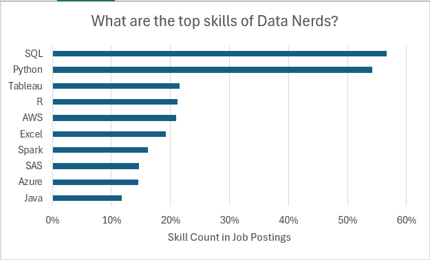
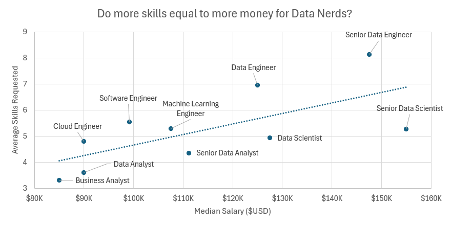
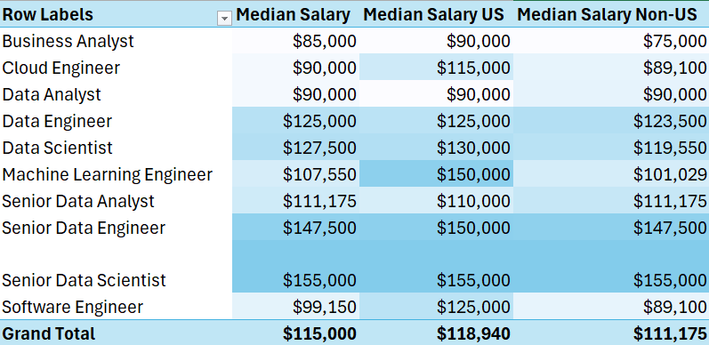
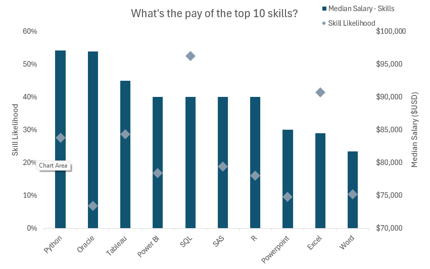

# Data Jobs Market Analysis - Excel Portfolio Project

> An end-to-end exploratory analysis of the data science job market, built entirely in Microsoft Excel. This project answers four key business questions using Pivot Tables, advanced formulas, Power Query, Power Pivot and data visualization techniques.

---

##  Project Overview

The goal of this project is to uncover actionable insights from a dataset of data-related job postings - identifying which skills are most in demand, how salaries vary across roles and regions, and what combinations of skills tend to command higher pay.

All analysis was performed natively in Excel, showcasing proficiency in data modeling, aggregation, and visualization without relying on external tools.

---

##  Business Questions Answered

| # | Question |
|---|----------|
| 1 | Which technical skills appear most frequently in data job postings? |
| 2 | How does median salary vary across different data roles? |
| 3 | Is there a salary gap between US-based and non-US data professionals? |
| 4 | Which skills are associated with higher-paying positions? |

---

## 📁 Workbook Structure

The workbook contains four analytical sheets, each addressing one of the business questions above:

### 1. `skill_job_analysis` - Skill Demand Ranking

Identifies the top 10 most requested technical skills in data job postings, measured by **Skill Likelihood** (proportion of jobs requiring each skill).

**Key findings:**
- **SQL (56.6%)** and **Python (54.1%)** are by far the most in-demand skills, appearing in over half of all postings.
- Cloud platforms (AWS at 20.9%) and visualization tools (Tableau at 21.6%) round out the top tier.
- Legacy tools like Java (11.7%) and SAS (14.7%) still maintain a presence but at lower rates.

---

### 2. `salary_vs_skills` - Salary vs. Skills Complexity

Cross-analyzes **Median Salary** against **Skills Per Job** for each role, exploring whether breadth of required skills correlates with higher pay.

**Key findings:**
- Senior Data Engineers require the most skills on average (~8.1 per posting) and earn a median of $147,500.
- Data Analysts require fewer skills (~3.6) and have the lowest median salary at $90,000.
- The data suggests a positive relationship between skill complexity and compensation.

---

### 3. `salary_analysis` - US vs. Non-US Salary Comparison

Breaks down **Median Salary** by job title, comparing domestic (US) and international compensation side by side.

**Key findings:**
- The US premium is most pronounced for **Machine Learning Engineers** ($150K US vs. $101K non-US) and **Software Engineers** ($125K vs. $89K).
- Senior roles such as **Senior Data Scientists** ($155K) show consistent salaries globally, suggesting this tier is internationally competitive.
- **Data Analysts** show no gap - $90K median in both markets.

---

### 4. `skill_salary_analysis` - Skill-to-Salary Mapping

Maps each skill to the **Median Salary** of jobs requiring it and the **Skill Likelihood** (how common it is), revealing which tools are both high-value and in-demand.

**Key findings:**
- **Python** leads with a median salary of $97,087 and is required in 27.7% of postings - the best combination of pay and demand.
- **Oracle** commands the highest associated salary (~$96,924) but appears in only 6.8% of jobs, making it a niche but lucrative skill.
- **Excel** and **Word** are the most common "baseline" tools, associated with lower-paying roles ($84,500 and $81,682 respectively).

---

##  Excel Techniques Used

- **Power Query** to clean the data
- **Power Pivot** to model the data and create Measures
- **PivotTables** for multi-dimensional aggregation
- **Calculated fields/Masures** for custom metrics using **DAX** (Skill Likelihood, Skills Per Job)

- **MEDIAN, COUNTIF, SUMIF** for statistical summaries
- **Conditional formatting** for visual hierarchy
- **Scatter, Bar, and Combo charts** for analytical storytelling
- **Named ranges** for formula readability
- **Data validation** for structured inputs

---

## 💡 Key Takeaways

1. **Python + SQL** is the non-negotiable foundation for any data career - no other combination offers that level of demand coverage.
2. **Seniority pays more than specialization** - Senior roles consistently outperform specialist roles even with similar skill sets.
3. **The US market still offers a significant salary premium**, especially at the mid-career level (MLE, Software Engineer).
4. **More skills = more salary**, but with diminishing returns - the sweet spot appears to be around 5–6 skills per role.

---

## 📂 Files

| File | Description |
|------|-------------|
| `Project_Analysis.xlsx` | Main workbook with all four analysis sheets |
| `README.md` | Project documentation (this file) |

---

## 👤 Author

**Erik**

Data Analysis Portfolio - Excel Advanced Skills Demonstration

---

*Dataset: Data science and analytics job postings market data.*